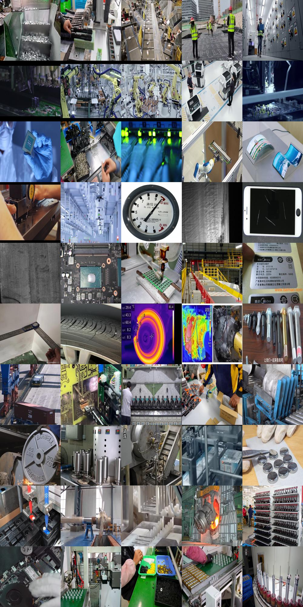
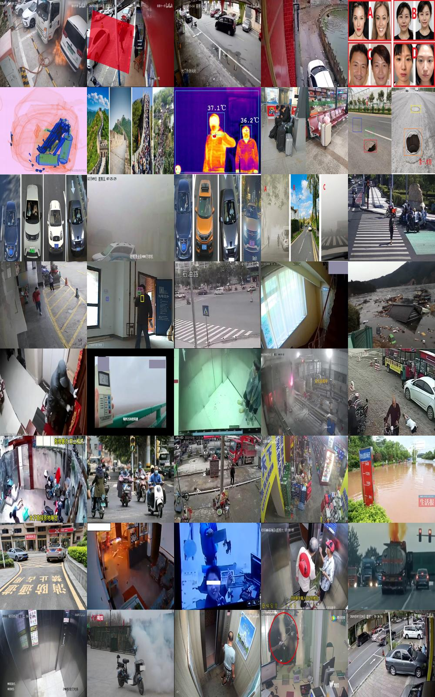
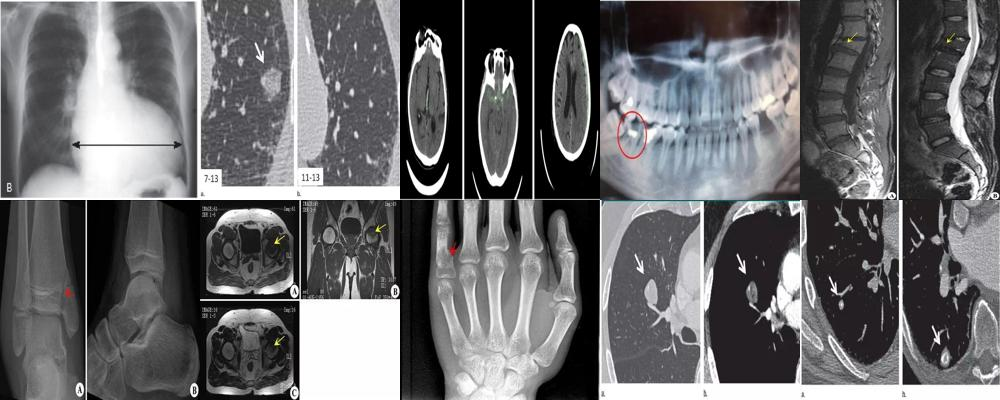
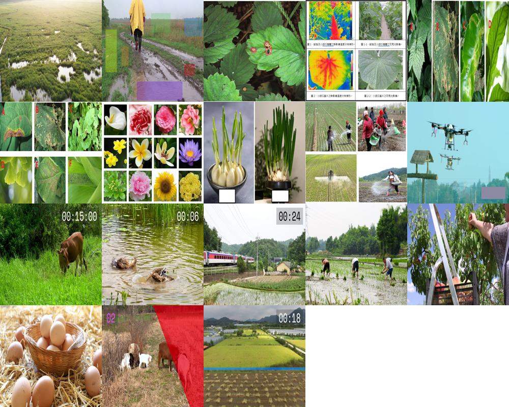
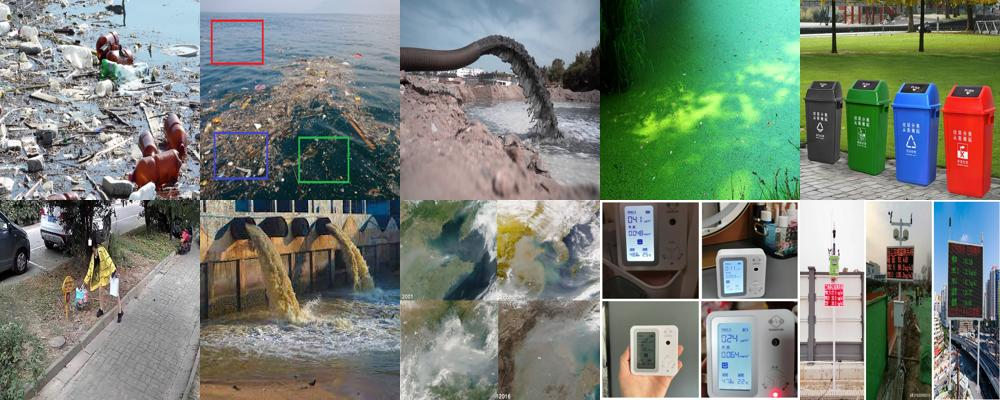
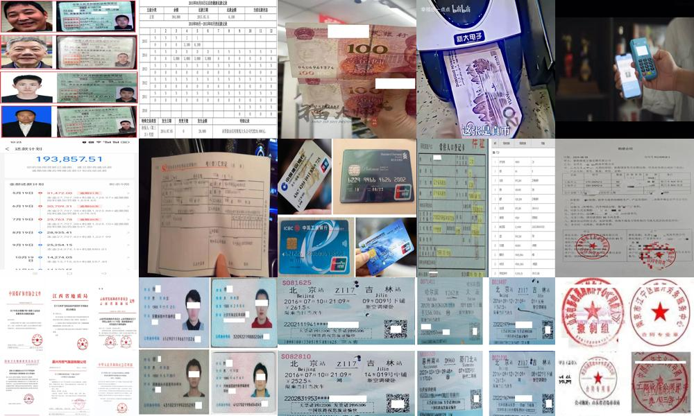
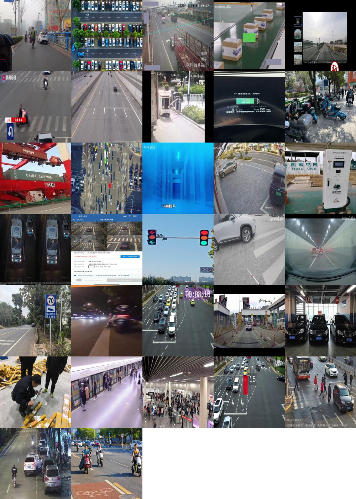
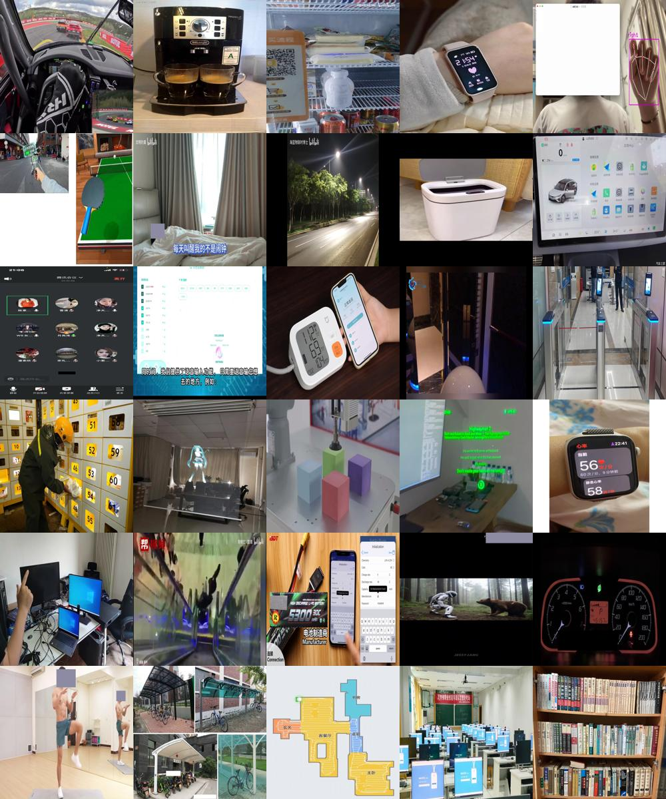

# Titan 计算机视觉智能体评测基准

Titan 计算机视觉智能体评测基准主要用于测试计算机视觉领域的智能体性能。我们广泛收集了200多条测试样例全面测试智能体的性能，尤其是其分步骤解决问题的能力。

**演示视频：https://youtu.be/dcUb4lUnGj4**

**Huggingface：https://huggingface.co/datasets/DataCanvasAILab/Titan-CV-Agent-Benchmark**

**媒体文件下载: [Google Drive](https://drive.google.com/file/d/14lcUsIBm1YshG-wajzWQdicBpitRhRGW/view?usp=drive_link)**

## 基本原则

为了区别传统测试视觉-语言模型的评测基准，所有收集的样例将遵循以下原则：

① **模态多样**，包括各种类型的图片和视频。领域丰富，包含工业、医疗、农业、环境、社交、文化、体育以及科学研究等多种领域。

② 每个问题将尽力维持其复杂性，不是任何一步（例如只使用VLM）就能够解决的。而是需要**多步骤的串行思考**。

③ 每个问题将**专注考察智能体的智能**，它必须对人类简单、对机器复杂，它看起来不复杂，除了医学领域，可以被任何一个毫无经验的成年人轻易理解，但需要充分调动其思考、认知能力。对于机器来说，传统的背诵、计算、速度优势是无益于解出这些题目的，需要其与人类相似的空间认知或高级理解能力。

④ 每个问题是复杂的，但**答案是简单的、可验证的**，避免开放式问答对结果检验的压力，如果类似位置区别的问题，为避免歧义，会给予一定的选项，但同时为了避免智能体猜测到正确答案，备选答案通常会设置到6个以上，降低其猜测的风险。


## Titan 计算机视觉智能体系列

[Titan 计算机视觉智能体沙箱](https://github.com/realbillbao/Titan-CV-Agent-Sandbox)

[Titan 计算机视觉智能体执行器](https://github.com/realbillbao/Titan-CV-Agent-Executor)

[Titan 计算机视觉智能体评测基准](https://github.com/realbillbao/Titan-CV-Agent-Benchmark)

## 模型基准
| Model Name               | Passed | Pass Rate       | Correct | Correct Rate  |
| ------------------------ | ------ | --------------- | ------- | ------------- |
| **Qwen2.5-72B-Instruct** | 139    | 139/205 = 67.8% | 15      | 15/205 = 7.3% |
| **DeepSeek-R1**          | 123    | 123/205 = 60.0% | 13      | 13/205 = 6.3% |
| **DeepSeek-V3**          | 178    | 178/205 = 86.8% | 13      | 13/205 = 6.3% |
| **Qwen3-235B-A22B**      | 102    | 102/205 = 49.8% | 11      | 11/205 = 5.4% |


## 问题分类

本测试集收集市面大部分CV问题，将其分为四大类，二十二小类：

### 工业制造与民生科技 （35%）

1. 工业制造（10%）（工业自动化检测 / 包装与物流分拣系统 / 建筑安全监测 / 能源电力巡检）
2. 公共安全（8%）（安防监控与异常行为检测 / 人脸、车牌识别 / 人群密度估计与流量分析 / 烟火、火灾自动检测与预警）
3. 医疗健康（8%）（医疗影像分析 / 视觉辅助与盲人导航技术 / 个性化康复)
4. 农业生产（6%）（病虫害检测 / 无人机图像处理 / 植物识别与园艺指导 / 农作物质量检测）
5. 环境监测（3%）（遥感图像分析 / 垃圾分类 / 动物识别与生态保护 / 土壤与水质分析 / 灾害应急与救援）

### 智慧城市与智能生活 （30%）

6. 金融科技（8%）（风险控制 / 票证识别与真伪检测 / 区块链 / 投资建议）
7. 交通物流（8%）（自动驾驶技术 / 智能交通管理 / 车牌识别与停车场管理 / 物流管理 / 包裹管理）
8. 智能终端（6%）（增强现实与虚拟现实 / 智能家居 / 智慧穿戴 / 智能玩具与游戏互动 / 室内导航与地图绘制 / 人机交互手势与姿态识别）
9. 电子商务（5%）（跨境电商 / 智慧零售与自动结账 / 线上购物 / 人体三维建模 / 虚拟试衣）
10. 社交生活（3%）（情绪识别与用户体验 / 内容标记 / 话题检测 / 智能广告推荐）

### 文化旅游与体育娱乐 （20%）

11. 文化教育（4%）（在线课堂 / 教育营销 / 智慧教育 / 艺术作品修复 / 手写字体识别）
12. 旅游向导（4%）（智慧园区 / 景区停车 / 生活互联 / 文创产品）
13. 传媒娱乐（3%）（内容创作 / 内容审核 / 视频摘要 / 智能剪辑 / 伪造检测 / 表情包生成）
14. 体育科技（3%）（人体行为分析 / 体育运动分析 / 运动追踪 / 体感游戏）
15. 修图美容（2%）（拍摄优化、美颜 / 智能相册 / 化妆模拟 / 发型设计）
16. 宠物饲养（2%）（宠物监控 / 宠物健康监测 / 智能喂食 / 宠物互动）
17. 艺术收藏（2%）（文物、珠宝真伪鉴别 / 艺术品价值评估）

### 科学研究与专业领域（15%）

18. 科学研究（4%）（海洋生物识别 / 动物迁徙研究 / 心理学研究）
19. 办公职场（4%）（会议记录与自动摘要 / 远程协作 / 智能考勤）
20. 政务司法（3%）（政务协同 / 智慧人社 / 证据分析 / 智能审判 / 合同审核）
21. 军事国防 （2%）(态势感知 / 伪装检测 / 敌方装备识别)
22. 航天航空 （2%）(卫星影像分析 / 飞机起降监控 / 跑道异物检测 / 飞行员辅助系统）

注意：这些类别的数据项将逐步收集，目前公开的数据集只涉及其中的1到8项，剩余项目将逐步开源。


## 数量分布

|                        |          | 相对占比（%） | 占比小计(%) | 绝对数量 | 数量小计 |
| ---------------------- | -------- | ------------- | ----------- | -------- | -------- |
| **工业制造与民生科技** | 工业制造 | 10            | 35          | 50       | 175      |
|                        | 公共安全 | 8             |             | 40       |          |
|                        | 医疗健康 | 8             |             | 40       |          |
|                        | 农业生产 | 6             |             | 30       |          |
|                        | 环境监测 | 3             |             | 15       |          |
| **智慧城市与智能生活** | 金融科技 | 8             | 30          | 40       | 150      |
|                        | 交通物流 | 8             |             | 40       |          |
|                        | 智能终端 | 6             |             | 30       |          |
|                        | 电子商务 | 5             |             | 25       |          |
|                        | 社交生活 | 3             |             | 15       |          |
| **文化旅游与体育娱乐** | 文化教育 | 4             | 20          | 20       | 100      |
|                        | 旅游向导 | 4             |             | 20       |          |
|                        | 传媒娱乐 | 3             |             | 15       |          |
|                        | 体育科技 | 3             |             | 15       |          |
|                        | 修图美容 | 2             |             | 10       |          |
|                        | 宠物饲养 | 2             |             | 10       |          |
|                        | 艺术收藏 | 2             |             | 10       |          |
| **科学研究与专业领域** | 科学研究 | 4             | 15          | 20       | 75       |
|                        | 办公职场 | 4             |             | 20       |          |
|                        | 政务司法 | 3             |             | 15       |          |
|                        | 军事国防 | 2             |             | 10       |          |
|                        | 航天航空 | 2             |             | 10       |          |
| 总计                   | N/A      | 100           |             | 500      |          |

注意：这些类别的数据项将逐步收集，目前公开的数据集只涉及其中的1到8项，剩余项目将逐步开源。


## 数据格式示例

### 数据格式

每个数据项包含6个字段：

```
"id": 数据项编号，按照“大类_小类_标号”命名。
"media_path": 数据项依赖的媒体位置。
"media_type": 数据项依赖的媒体类型。
"query": 针对媒体的提问。
"answer": 问题的回答。
"note": 备注，例如是如何获得答案的记录。
```

### 数据示例

```json
[
    {
        "id": "1_1_1",
        "media_path": "media/01/1_1_1.mp4",
        "media_type": "video",
        "query": "有一个监控摄像头设置在生产线出料口，加工完的金属零件会沿着绿色倾斜平面滑落到下方接料盒，请统计一共有多少金属零件被生产出来？请回答一个整数，例如：10。请直接输出答案，不要输出任何符号、解释或说明。",
        "answer": "11",
        "note": "2+3+4+2=11"
    },
    {
        "id": "1_1_2",
        "media_path": "media/01/1_1_2.mp4",
        "media_type": "video",
        "query": "为了监督工人的产品专配过程，防止漏装、错装，工人的左手边、右手边和中间各有三堆零件，请阐述其零件拿取顺序，零件可以重复拿取。请按照：(中文单字,中文单字,中文单字)的格式直接回答，例如：(中,左,左)。请直接输出答案，不要输出任何符号、解释或说明。",
        "answer": "(右,左,中)",
        "note": "共计4个零件"
    },
    {
        "id": "1_1_3",
        "media_path": "media/01/1_1_3.mp4",
        "media_type": "video",
        "query": "请制作一个焊接检测系统，检测绿色电路板中零件数量和每个零件需要自动焊接多少次？请按照：(零件数量（整数）,每个零件需要自动焊接次数（整数）)的格式直接回答，例如：(10,1)。请直接输出答案，不要输出任何符号、解释或说明。",
        "answer": "(60,2)",
        "note": ""
    }
]
```


## 数据媒体示例

### 工业制造



### 公共安全



### 医疗健康



### 农业生产



### 环境监测



### 金融科技



### 交通物流



### 智能终端




## 致谢

此项目由北京九章云极科技有限公司提供支持：

***[九章云极 - 助力全球企业智能升级](https://www.datacanvas.com/AboutUs)***

> 咨询热线：+86 400-805-7188
>
> 电子邮件：sophia@zetyun.com
>
> 北京职场：北京市海淀区和盈中心C座6层&8层
>
> 上海职场：上海市静安区市北壹中心1号楼10层


## 许可证

Titan 计算机视觉智能体评测基准将使用下列许可证:

**Apache License Version 2.0**